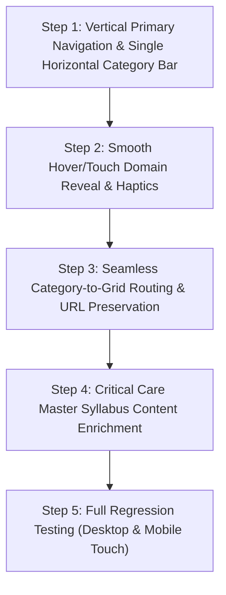

# Phase 1: Recommendations & Implementation Roadmap

## 1. Executive Summary

Phase 1 conducted an exhaustive audit of the KnockoutNotes Study Mode codebase (`study.html`, `study-data.js`, `study-ui.js`, `study-ron-design.js`, `study-molecule-3d.js`, and associated stylesheets). 

The audit established that:
1. **Total Asset Count**: 171 items (87 clinical/investigative topics and 84 pharmacological monographs).
2. **Current Navigation Bottleneck**: Categories were previously presented in a flat or two-row layout that blurred the lines between clinical anaesthesia practice, intensive care medicine, and drug monographs.
3. **Architecture Goal**: Transition to a 3-domain structure:
   - **ANAESTHESIA** (Vertical Item 1)
   - **CRITICAL CARE** (Vertical Item 2)
   - **DRUGS** (Vertical Item 3)
   with each domain expanding into a sleek single-line horizontal category strip with smooth scrolling.

---

## 2. Recommended Migration Sequence



### Step 1: Navigation Controller Update
- Upgrade the Study navigation header into a dual-axis layout:
  - **Left/Top Primary Column**: Vertically stacked primary domains: `Anaesthesia`, `Critical Care`, `Drugs`.
  - **Horizontal Secondary Track**: Dynamic, single-row track displaying only the categories belonging to the selected domain.
- Provide smooth scroll buttons or touch drag for horizontal category exploration.

### Step 2: Domain-Aware State Management
- Extend active state:
  ```javascript
  let activeDomain = "anaesthesia"; // "anaesthesia" | "critical" | "drugs"
  let activeCat = "all";
  let activeItem = null;
  ```
- Retain fallback logic: If a user navigates to `study.html?cat=relaxants`, automatically activate domain `"drugs"` and category `"relaxants"`.

### Step 3: Critical Care Content Onboarding
- Expand the 16 master Critical Care syllabus modules outlined in `critical-care-coverage-matrix.md` with referenced point-wise content from SSC 2026, KDIGO, and Berlin ARDS guidelines.

### Step 4: Verification & Zero-Downtime Deployment
- Verify all 171 topic/drug IDs in `study-data.js` match workspace bookmarks and sticky notes.
- Confirm 3D molecular structures load without WebGL context loss.

---

## 3. Risk Mitigation & Safeguards

| Potential Risk | Impact | Mitigation Strategy |
|---|---|---|
| Broken User Bookmarks / Notes | High | Maintain all 171 legacy IDs (`id: "succinylcholine"`, etc.). Never rename existing IDs. |
| Mobile Screen Space Squeeze | High | Ensure vertical domain pills collapse cleanly into compact chips on mobile viewports (<600px). Secondary category track uses single horizontal row with `overflow-x: auto`. |
| Layout Shifts on Domain Hover | Medium | Use fixed min-height containers and CSS transitions (`transform`, `opacity`) instead of DOM insert/remove cycles. |
| URL Routing Desynchronization | Medium | Deep link parser checks `domain`, `cat`, and `item` params with automatic auto-detection fallback. |

---

## 4. Phase 1 Deliverables Status

- [x] Repository Audit (`study-mode-repository-audit.md`)
- [x] Master Syllabus Mapping (`master-study-syllabus.md`)
- [x] Content Migration Matrix CSV (`study-content-migration-matrix.csv`)
- [x] Critical Care Coverage Matrix (`critical-care-coverage-matrix.md`)
- [x] Target Architecture Specification (`study-mode-target-architecture.md`)
- [x] Implementation Roadmap (`phase-1-recommendations.md`)
