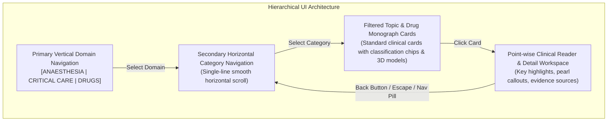

# Study Mode Target Architecture & Content Model

## 1. Executive Architecture Overview

The KnockoutNotes Study Mode revamp introduces a streamlined, three-tiered academic knowledge system designed specifically for anaesthesiology and intensive care trainees and consultants.



---

## 2. Hierarchical Taxonomy

```text
Domain (Top-level vertical selector: 3 domains)
 ├── Category (Horizontal single-line scroll track)
 │    ├── Topic / Drug Monograph (Interactive tile card)
 │    │    ├── Section (Clinical Overview, Indications, Dosing, Pitfalls)
 │    │    │    └── Subsection / Point-wise highlights & badges
```

### Domain Definitions
1. **ANAESTHESIA**:
   - `general-anaesthesia`: Induction, Maintenance, Emergence, Airway, Pre-op
   - `airway`: Difficult Airway Algorithms, Videolaryngoscopy, Surgical Airway
   - `regional`: Neuraxial (Spinal, Epidural), Peripheral Nerve Blocks, LA Toxicity
   - `cardiac`: Hemodynamic monitoring, Valve Anaesthesia, CPB
   - `neuro`: ICP Dynamics, Brain Protection, Craniotomy Anaesthesia
   - `obstetric`: Preeclampsia, Labour Analgesia, Emergency C-Section
   - `paediatric`: Pediatric Airway, Fluid Management, Congenital Anomalies
   - `speciality`: Trauma, Burns, Transplant, Laparoscopy, Geriatrics
   - `monitoring`: ECG, Hemodynamics, Capnography, Depth of Anaesthesia (BIS)
   - `equipment`: Anaesthesia Workstation, Breathing Systems, Vaporizers
   - `pain`: Acute Postoperative Pain, Chronic Pain, Multimodal Regimens

2. **CRITICAL CARE**:
   - 16 core categories structured exactly as defined in the master syllabus:
     1. `general-principles`
     2. `airway-icu`
     3. `respiratory-icu`
     4. `hemodynamics`
     5. `sepsis-infection`
     6. `neuro-icu`
     7. `cardio-icu`
     8. `renal-metabolic`
     9. `gi-hepatic`
     10. `trauma-burns`
     11. `poisoning-enviro`
     12. `hematology-transfusion`
     13. `obstetric-icu`
     14. `pediatric-icu`
     15. `icu-pharmacology`
     16. `research-advances`

3. **DRUGS**:
   - Dedicated pharmacology monographs categorized by pharmacological class:
     - `induction-agents`: Propofol, Etomidate, Ketamine, Thiopental
     - `sedatives`: Midazolam, Dexmedetomidine, Diazepam
     - `opioids`: Fentanyl, Remifentanil, Morphine, Alfentanil, Sufentanil, Naloxone
     - `non-opioid-analgesics`: Paracetamol, Ketorolac, Parecoxib, Gabapentin
     - `neuromuscular-blockers`: Succinylcholine, Rocuronium, Vecuronium, Atracurium, Cisatracurium
     - `reversal-agents`: Sugammadex, Neostigmine, Glycopyrrolate, Atropine
     - `local-anaesthetics`: Lignocaine, Bupivacaine, Ropivacaine, Levobupivacaine
     - `inhalational-agents`: Sevoflurane, Desflurane, Isoflurane, Nitrous Oxide
     - `vasopressors-inotropes`: Norepinephrine, Epinephrine, Vasopressin, Dobutamine, Milrinone
     - `cardiovascular-drugs`: Labetalol, Esmolol, Metoprolol, Amiodarone, Nicardipine
     - `icu-drugs`: Hydrocortisone, Methylprednisolone, Regular Insulin, Furosemide
     - `emergency-drugs`: Calcium Gluconate, Intralipid 20%, Sodium Bicarbonate
     - `obstetric-pediatric-drugs`: Oxytocin, Carboprost, Ergometrine, Tranexamic Acid

---

## 3. Data Schema & Model Specification

All records in `window.KN_STUDY` remain backward-compatible with existing IDs. The unified record schema supports both topics and drug monographs:

```typescript
interface StudyItem {
  id: string;                      // Stable unique identifier (e.g., 'propofol', 'airway-assessment')
  domain: 'anaesthesia' | 'critical-care' | 'drugs'; // High-level primary domain
  cat: string;                     // Major category ID
  name: string;                    // Full display title
  short?: string;                  // Short title / abbreviation (e.g., 'Scoline', 'RSI')
  type: 'topic' | 'drug';          // Content type
  classification?: string;         // Standard pharmacological or clinical classification
  formula?: string;                // Chemical formula (for drugs)
  mw?: string;                     // Molecular weight (for drugs)
  tags: string[];                  // Search tags & indexing keywords
  tagline: string;                 // High-yield one-line clinical summary
  source: string;                  // Primary source citation (Miller 10th, Barash, Surviving Sepsis 2026, FDA)
  sections: StudySection[];        // Structured clinical sections
  structure3d?: boolean;          // Whether 3D molecular viewer is bound
}

interface StudySection {
  id?: string;
  heading: string;
  body?: string;
  points?: string[];               // Point-wise high-yield facts
  calloutType?: 'pearl' | 'pitfall' | 'warning' | 'evidence';
  table?: {
    headers: string[];
    rows: string[][];
  };
}
```

---

## 4. URL Routing & Deep-Link Backward Compatibility

To preserve existing bookmarks, direct URLs, and social links:

- **New Canonical URL Format**:
  - `study.html?domain=drugs&cat=induction-agents&item=propofol`
- **Backward-Compatible Resolution**:
  - If a legacy URL is accessed: `study.html?cat=induction` or `study.html?item=propofol`
  - The router checks the target item or category ID against a mapping dictionary.
  - Automatically infers `domain = 'drugs'` and highlights the appropriate vertical domain and horizontal category without breaking the user experience or throwing 404s.

---

## 5. UI/UX & Interaction Specs

1. **Vertical Primary Domain Selector**:
   - Fixed, compact vertical menu containing three domain buttons:
     1. **ANAESTHESIA** (Teal/Emerald theme accent)
     2. **CRITICAL CARE** (Cyan/Sky theme accent)
     3. **DRUGS** (Indigo/Violet theme accent)
   - Hover / focus reveals the associated category track horizontally.
   - On touch devices (smartphones and tablets), a tap toggles the active domain and immediately displays the categories.
   - Active domain indicator uses smooth CSS scale, subtle box-shadow glow, and high-contrast text.

2. **Secondary Horizontal Category Navigation**:
   - Rendered as a single horizontal line (`white-space: nowrap; overflow-x: auto; -webkit-overflow-scrolling: touch;`).
   - Uses `scroll-behavior: smooth` and scroll-padding.
   - Includes badge counters indicating the number of topics/drugs in each category.
   - Zero vertical height explosion: compact height (36–42px).

3. **Touch & Haptic Feedback**:
   - `if (navigator.vibrate) { navigator.vibrate(8); }` triggered on primary domain switch on supported mobile browsers.
   - Smooth CSS transitions (`transition: transform 0.2s cubic-bezier(0.2, 0.8, 0.2, 1), opacity 0.2s ease`).
